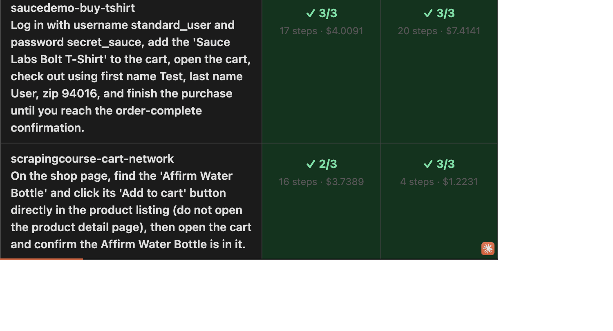

# taskproof

Playwright for the agent channel — an open-source CI harness that runs a matrix of real AI
agents (Claude computer use, browser-use, …) through defined tasks on your website, docs, or
MCP server, scoring task completion, cost, and the exact failure point, and diffing
agent-usability across releases.

**Readiness checklists tell you whether your site _looks_ agent-friendly. taskproof tells you
whether agents actually _complete the task_ — where they fail, and what it costs.**

> Status: pre-release. Runs from this repo for now — the npm package is a reserved placeholder.



## What it does

Write task specs (YAML: a natural-language goal + deterministic success assertions), point
taskproof at your site, and it drives real agents through each task, grades them with pass@k,
and renders a report that pinpoints where they failed — plus a baseline diff so CI catches
agent-usability regressions.

A real run against saucedemo's `problem_user`, whose checkout form is deliberately broken —
taskproof catches that neither agent can complete the purchase, and points at the step:

```text
$ taskproof run saucedemo-problem-user-checkout.yaml --models claude-opus-4-8,browser-use

saucedemo-problem-user-checkout
  ✗ claude-opus-4-8   pass@3 0/3 (need 2)   21 steps   $6.16
  ✗ browser-use       pass@3 1/3 (need 2)   23 steps   $8.04
      ↳ stuck at /checkout-step-one.html — never reached checkout-complete

0/2 cell(s) passed · total $14.19        # exits non-zero in CI when a cell fails
```

Every number above is from a committed run. **See the report it renders** — the pass/fail matrix
plus drill-down traces with screenshots of exactly where each agent got stuck — in
[`examples/sample-report/`](examples/sample-report/): open
[`report.html`](examples/sample-report/report.html) (or
[view it rendered](https://raw.githack.com/taskproof/taskproof/main/examples/sample-report/report.html))
— no install or API key needed. The cost is high because both agents keep retrying the sabotaged
form until the budget cap.

## Quickstart

Requires Node ≥ 22, pnpm 10, and an `ANTHROPIC_API_KEY`.

```bash
pnpm install && pnpm build
pnpm --filter @taskproof/adapter-claude exec playwright install chromium
alias taskproof="node $(pwd)/packages/cli/dist/index.js"   # until the npm package ships
export ANTHROPIC_API_KEY=sk-ant-…

# Watch a real agent do a task, get graded, and render a report (~$0.10–0.20):
cat > /tmp/try.yaml <<'YAML'
specVersion: "0.1"
id: wikipedia-shannon
goal: "Search Wikipedia for 'Claude Shannon', open his article, and report his birth year."
entryUrl: "https://en.wikipedia.org/wiki/Main_Page"
maxSteps: 20
maxCostUsd: 5
assertions:
  - type: url
    pattern: "**/wiki/Claude_Shannon**"
YAML
taskproof run /tmp/try.yaml -k 1 --out runs
taskproof report --dir runs && open runs/report.html
```

The full walkthrough — `init` scaffolding, the spec format, multi-model matrices, the
browser-use sidecar, baselines, and CI — is in **[docs/TESTING.md](docs/TESTING.md)**.

## How it works

`taskproof init` scaffolds starter specs → `taskproof run` drives each agent through each
task (pass@k) and grades it against deterministic `url` / `dom` / `network` assertions →
`taskproof report` renders the matrix + per-step trace with screenshots → `taskproof baseline
save` + `taskproof diff` turn it into a CI regression gate.

The moat is uniformity: every runner adapter emits the **identical** run-artifact schema and
grades through the **same** grader, so a Claude run and a browser-use run are directly
comparable. Adding a vendor is implementing one interface — see
[CONTRIBUTING.md](CONTRIBUTING.md).

## Why pass@k — non-determinism, by design

Agents don't behave identically run to run, so a single pass/fail would be noise. The usual
objection to testing them ("it's flaky") is designed around, not ignored:

- **pass@k with a statistical threshold, never a binary gate** — run each task `k` times, pass
  when at least a threshold succeed.
- **Deterministic assertions first** — `url`/`dom`/`network` checks decide the verdict; an
  optional, versioned LLM judge can layer on top for goals that aren't reducible to a selector,
  but it never replaces the deterministic checks.
- **Soft cost caps** — every spec carries a `maxCostUsd` and `run` takes `--max-cost`; on Claude
  the run stops before a turn it can't afford (overshoot ≤1 turn), while browser-use is bounded by
  `maxSteps`, not cost.
- **Regression diffs, not absolute gates** — CI compares against a saved baseline and reports
  what moved, so a flaky cell shows up as signal rather than a spuriously red build.

## Limitations

- **The fidelity gap (read this).** taskproof drives _automatable_ agent harnesses — Claude
  computer-use and browser-use — as a **proxy** for the consumer agents your users actually run
  (ChatGPT Atlas, Perplexity Comet, …), which expose no automation API to test against. The same
  frontier models power both, but taskproof does **not** claim its harnesses behave identically
  to those products. A calibration study with design partners is planned; until then, read a
  result as "a capable agent harness can/can't complete this," not "Atlas will/won't."
- **Pre-release.** The task-spec format and run-artifact schema may still break between `0.x`
  releases; the npm package is a reserved placeholder, so run from this repo for now.

## In CI

Commit a baseline on your default branch, then on each PR run the cheap lane and post a
sticky comment when agent usability regresses (illustrative):

```text
### ⚠️ taskproof: 1 agent-usability regression(s)

| Change      | Task       | Model             | pass@k    |
| ----------- | ---------- | ----------------- | --------- |
| ✗ REGRESSED | `checkout` | `claude-opus-4-8` | 5/5 → 1/5 |
```

Copy-paste GitHub Actions templates (Claude lane and a cheap browser-use lane) and the
reusable comment action are in **[examples/github/](examples/github/)**. The check is
advisory by default — `taskproof diff` exits `0`/`1`/`2` (clean/regression/error) like unix
`diff`, so you can flip it to a required check whenever you trust the signal.

## Packages

| Package                                                          | What it is                                                                                                                              |
| ---------------------------------------------------------------- | --------------------------------------------------------------------------------------------------------------------------------------- |
| [`@taskproof/spec`](packages/spec)                               | The task-spec format — versioned YAML schema with Zod validation. Start here.                                                           |
| [`@taskproof/core`](packages/core)                               | Shared contract: the run-artifact schema, the adapter interface, the cost meter.                                                        |
| [`@taskproof/grader`](packages/grader)                           | Deterministic `url`/`dom`/`network` assertion engine + pass@k aggregation.                                                              |
| [`@taskproof/judge`](packages/judge)                             | WebJudge-style LLM judge: versioned prompt + golden-set eval; runs after the deterministic checks and can only turn a pass into a fail. |
| [`@taskproof/report`](packages/report)                           | Self-contained HTML report + the baseline-diff regression engine.                                                                       |
| [`@taskproof/adapter-claude`](packages/adapter-claude)           | Claude computer-use adapter (Playwright-managed Chromium).                                                                              |
| [`@taskproof/adapter-browser-use`](packages/adapter-browser-use) | browser-use adapter, via a thin Python/FastAPI sidecar.                                                                                 |
| [`taskproof`](packages/cli)                                      | The `taskproof` CLI: `init` / `validate` / `run` / `report` / `baseline` / `diff`.                                                      |

## Development

```bash
pnpm install
pnpm build        # tsc, topological
pnpm test         # builds, then vitest across packages
pnpm lint         # eslint (type-checked)
pnpm format       # prettier
pnpm -r run typecheck
```

The browser-use sidecar is a separate Python (`uv`) project under
`packages/adapter-browser-use/sidecar` — see its README. Releases use `pnpm publish` (never
`npm publish`): internal deps are `workspace:^`, which only pnpm rewrites at pack time.

## License

[Apache-2.0](LICENSE) — chosen over MIT for the explicit patent grant, which matters if the
task-spec format becomes a standard others implement. The CLI, spec, adapters, grader, and
report generator are open forever.
